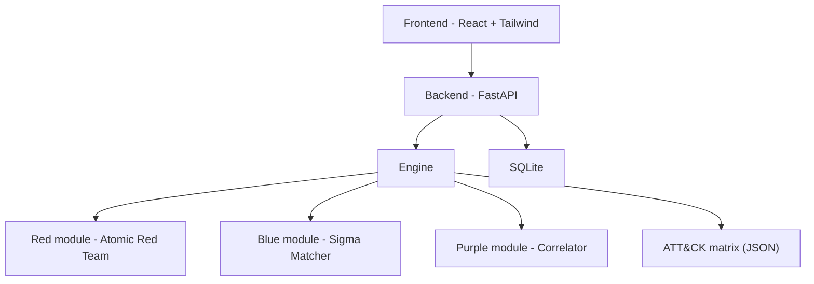

# compass_purple


Open-source Purple Team dashboard started in February 2026. Simulate adversarial techniques on the Red side, ingest and analyze logs on the Blue side, then correlate both to visualize detection coverage against the MITRE ATT&CK framework.

---

## Overview



### Project structure

```
compass_purple/
├── frontend/         - React + Tailwind - main dashboard UI
├── backend/          - FastAPI - REST API and orchestration
├── engine/
│   ├── base.py       - Abstract interfaces: RedModule, BlueModule, PurpleModule
│   ├── loader.py     - Auto-discovers and loads modules from subdirectories
│   ├── red/          - Attack simulation modules
│   ├── blue/         - Log ingestion and detection modules
│   └── purple/       - Correlation and reporting modules
├── data/
│   ├── atomic/       - Atomic Red Team (git submodule)
│   └── attack/       - Local ATT&CK matrix (JSON)
└── docker-compose.yml
```

---

## Usage

### Prerequisites

- Docker + Docker Compose
- Git

### Run locally

```bash
git clone --recurse-submodules https://github.com/Giremuu/compass_purple.git
cd compass_purple
docker compose up
```

Then open [http://localhost:3000](http://localhost:3000).

---

## Specificities

### Red - Attack simulation

- Launch [Atomic Red Team](https://github.com/redcanaryco/atomic-red-team) tests from the UI
- Browse and filter techniques by ATT&CK tactic
- Guided interface with technique descriptions and risk level

### Blue - Detection and analysis

- Ingest local logs (syslog, Windows Event, flat files)
- Match events against [Sigma](https://github.com/SigmaHQ/sigma) rules
- Timeline view of suspicious activity

### Purple - Correlation engine

- Cross-reference each Red test with Blue alerts
- Result per technique: `Detected` / `Partial` / `Missed`
- ATT&CK heatmap of detection coverage
- Export exercise reports (JSON)

### Module system

Each module inherits from a base interface and is auto-discovered at startup.

```python
class MyRedModule(RedModule):
    name = "my_module"
    description = "Does something custom"

    def run(self, params: dict) -> dict:
        ...
```

### Stack

| Layer | Technology |
|---|---|
| Frontend | React + Tailwind CSS |
| Backend | FastAPI (Python) |
| Engine | Python |
| Database | SQLite |
| Deployment | Docker Compose |

### Other projects

| Project | Description |
|---|---|
| [suzune_check](https://github.com/Giremuu/suzune_check) | Security audit tool with Ansible for Debian/Ubuntu |
| [fern_ops](https://github.com/Giremuu/fern_ops) | IaC stack with supervision |
| [ishtar_sound](https://github.com/Giremuu/ishtar_sound) | Public blindtest webapp |

---

## License

MIT - see [LICENSE](./LICENSE) for details.